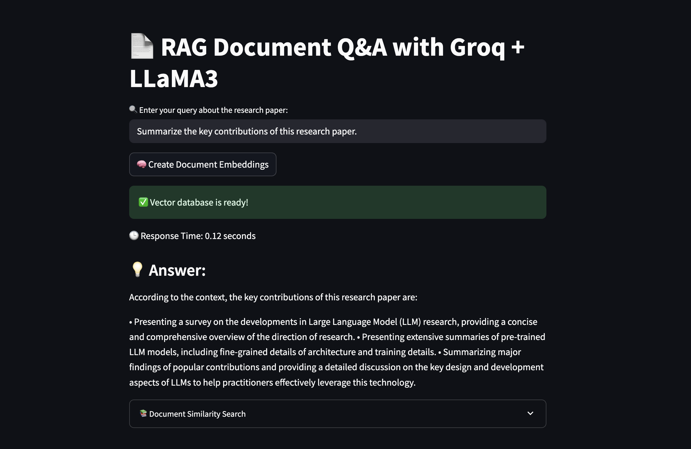

# Grok PDF Q&A with LangChain and FAISS

An interactive, real-time **Retrieval-Augmented Generation (RAG)** system that allows users to ask questions about PDF documents using **LangChain**, **FAISS**, and **Groq’s LLaMA3** large language model — all wrapped in a clean **Streamlit** UI.

---

## Features

- Upload PDFs and ask contextual questions about their content
- Uses FAISS for vector similarity search and OpenAI embeddings
- Chunk-based PDF text splitting using LangChain
- Powered by **Groq's ultra-fast LLaMA3 model**
- Real-time question answering with semantic search
- Deployed via **Streamlit** for easy web-based interaction

---

## Demo

*Example query:*

---

## Tech Stack

| Component     | Tool / Library                |
|---------------|-------------------------------|
| RAG Framework | LangChain                     |
| Vector Store  | FAISS                         |
| Embeddings    | OpenAI Embeddings             |
| LLM           | Groq (LLaMA3-8B-8192)          |
| UI            | Streamlit                     |
| PDF Parsing   | PyMuPDF + LangChain loaders   |
